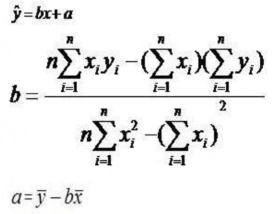

# 总结

这场比赛只过了两个题：G 和 J。G 是个简单构造题，J 是个基础数学题（竟然卡精度，最开始就用double 过不去）。


# 题解

TO BE COMPLETED

## G

### yh

G 是个构造题。考虑分组，组内递增，组间递减，最小值为根号。

```cpp
#include<bits/stdc++.h>
#define ll long long
#define lll __int128
using namespace std;

const ll MAX = 5e5;

int main() {
    ios::sync_with_stdio(false);
    cin.tie(NULL);
    cout.tie(NULL);
    int t;
    cin >> t;
    while (t--) {
        int n;
        cin >> n;
        int m = 1;
        for (;m * (ll)m < (ll)n;m++);
        for (int group = (n + m - 1) / m;group >= 0;group--) {
            int val;
            for (int i = 0;i < m && (val = i + group * m) < n;i++)
                printf("%d ", val + 1);
        }
        printf("\n");
    }
}
```

## J

### yh

这是个最小二乘解线性回归。公式贴在这：



这个题就离谱，tnnd，卡精度，后面用 `__int128` 才过。

```cpp
#include<bits/stdc++.h>
#define ll long long
#define lll __int128
using namespace std;

inline ll read() {
    ll x = 0, f = 1;
    char ch = getchar();
    while (ch < '0' || ch > '9') { if (ch == '-')f = -1;ch = getchar(); }
    while (ch >= '0' && ch <= '9') { x = x * 10 + ch - '0';ch = getchar(); }
    return x * f;
}

const ll MAX = 5e5;
ll x[MAX], y[MAX];


int main() {
    // ios::sync_with_stdio(false);
    // cin.tie(NULL);
    // cout.tie(NULL);
    ll t = read();
    while (t--) {
        ll n = read();
        lll cross_sum = 0;
        lll x_sum = 0;
        lll y_sum = 0;
        lll x2_sum = 0;
        for (int i = 0;i < n;i++) {
            x[i] = i;
            y[i] = read();
            cross_sum += x[i] * (lll)y[i];
            x_sum += x[i];
            y_sum += y[i];
            x2_sum += x[i] * (lll)x[i];
        }
        double b = (n * (double)cross_sum - x_sum * (double)y_sum)
            / (n * (double)x2_sum - x_sum * (double)x_sum);
        double a = y_sum / (double)n - b * x_sum / (double)n;
        double ans = 0;
        for (int i = 0;i < n;i++) {
            double y_predict = b * i + a;
            ans += (y_predict - y[i]) * (y_predict - y[i]);
        }
        printf("%.9lf\n", ans);
    }
}
```

